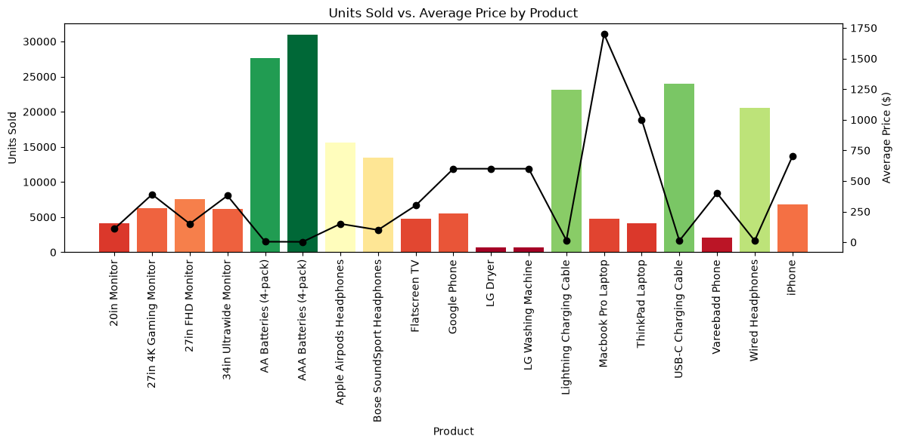
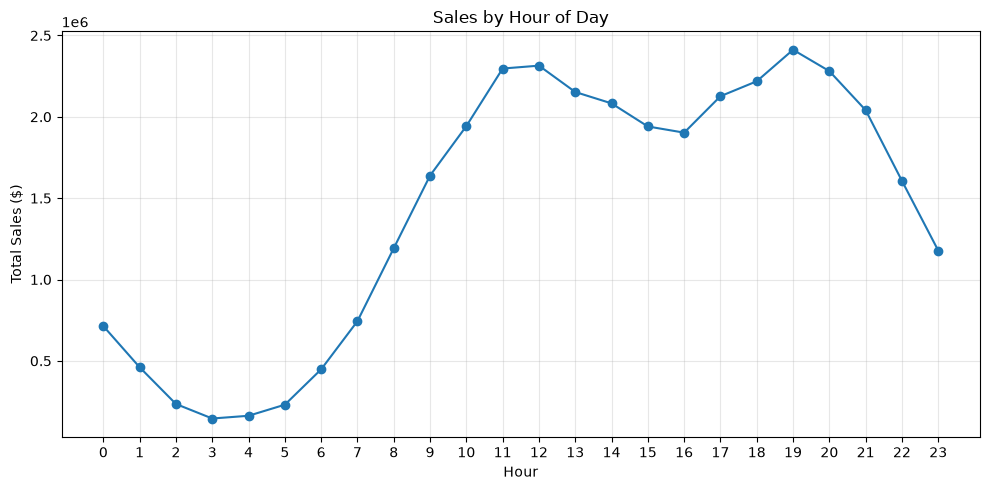
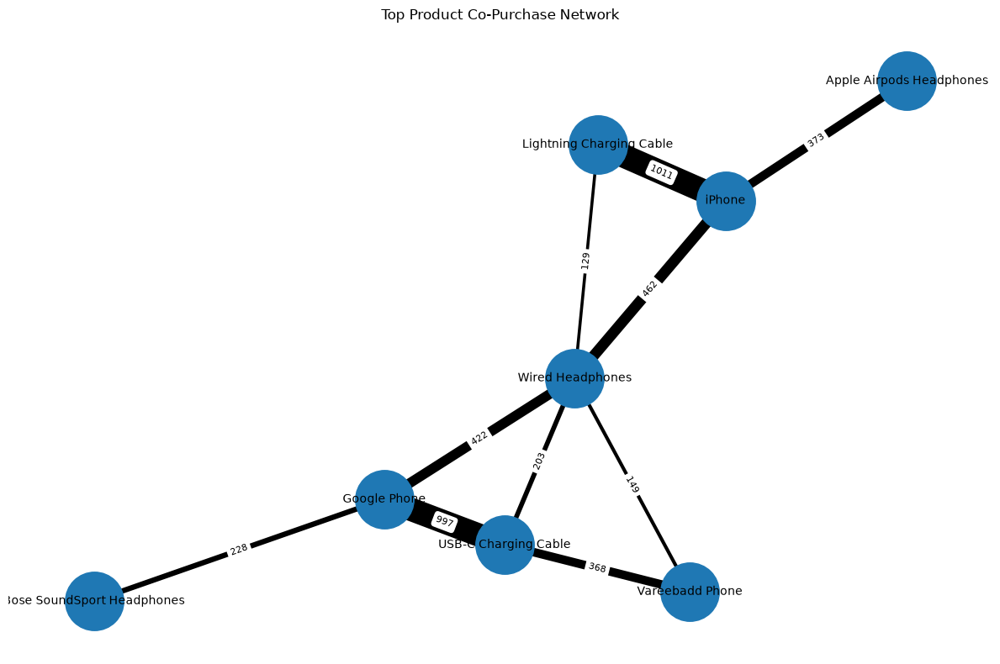
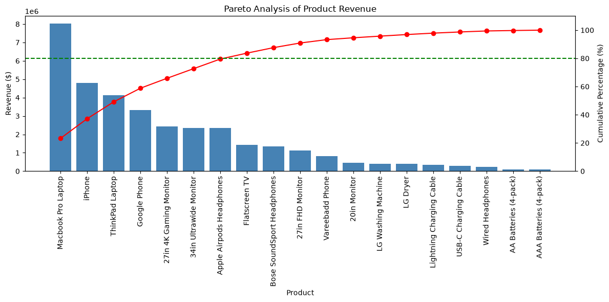

# Sales Data Analysis

An end-to-end exploratory data analysis of a retail sales dataset — uncovering trends in
**when**, **where**, and **what** customers buy, and which products are most often
purchased together.

## Objectives

- Identify the best-performing months, days, and hours for sales
- Find which city generates the most orders
- Determine the best-selling and highest-revenue products
- Discover which products are frequently bought together (market basket analysis)
- Segment products by revenue contribution using ABC / Pareto analysis

## Dataset

The dataset (`data/sales_data.ftr`) contains individual order line items, with the
following fields:

| Column             | Description                              |
|---------------------|-------------------------------------------|
| Order ID            | Unique identifier for the order           |
| Product             | Product name                              |
| Quantity Ordered    | Units of the product purchased            |
| Price Each          | Unit price at time of purchase            |
| Order Date          | Date and time the order was placed        |
| Purchase Address     | Delivery address (used to derive city)    |

> Add a note here on where the dataset came from (e.g. Kaggle link) and its license.

## Technologies Used

- Python 3.13
- pandas — data cleaning and aggregation
- matplotlib — visualizations
- networkx — product co-purchase network graph
- mlxtend — association rule mining (Apriori algorithm)
- pyarrow — reading the `.ftr` (Feather) data file

## Project Structure

```
sales-data-analysis/
├── data/
│   └── sales_data.ftr        # raw dataset
├── Sales_Analysis.ipynb  # main analysis notebook
├── images/                   # exported chart images for this README
├── README.md
├── requirements.txt
└── .gitignore
```

## Installation

```bash
git clone https://github.com/<your-username>/sales-data-analysis.git
cd sales-data-analysis
python -m venv venv
source venv/bin/activate      # Windows: venv\Scripts\activate
pip install -r requirements.txt
```

## Requirements

See [`requirements.txt`](requirements.txt) for the full list of dependencies.

## How to Run

```bash
jupyter notebook notebook/Sales_Analysis.ipynb
```
Run all cells from top to bottom.

## Analysis Workflow

1. **Data Loading & Inspection** — load the raw Feather file, check for missing values
2. **Data Cleaning** — drop empty/duplicate rows and stray header rows
3. **Feature Engineering** — derive `Month`, `City`, `Sales`, `Hour`, and `Day` columns
4. **Exploratory Data Analysis** — sales by month, city, product, and time of day
5. **Market Basket Analysis** — products frequently bought together, using co-purchase
   networks and association rule mining (Apriori)
6. **Revenue Analysis (ABC / Pareto)** — classify products into revenue tiers

## Key Findings

**Sales trends**
- Sales show clear seasonality, peaking in **December**, likely driven by increased holiday shopping and year-end demand.
- **San Francisco** accounts for the largest share of total revenue, while a small number of major cities contribute a disproportionately large share of overall sales.
  cities accounting for a disproportionate share overall
- Lower-priced products sell in much higher volumes than premium products, whereas high-priced products such as laptops and smartphones generate a significantly larger share of total revenue.
- Orders increase rapidly after **7:00 AM** and reach their highest sales at around **7:00 PM**, with another strong sales period between **11:00 AM and 12:00 PM**. These peak hours represent the best opportunities for promotional campaigns, inventory readiness, and staffing.

**Market basket analysis**
- Google Phone is frequently purchased together with a USB-C Charging Cable, indicating a strong cross-selling opportunity (Lift ≈ 2.08).
- iPhone is commonly purchased with a Lightning Charging Cable (Lift ≈ 2.16), suggesting that recommending compatible accessories during checkout could increase average order value.

### Revenue Segmentation (ABC / Pareto)

- Pareto analysis reveals that just **7 out of 19 products (36.8% of the product catalog)** generate nearly **80% of total revenue**, demonstrating a strong concentration of revenue among a relatively small number of products.
- The company's primary revenue drivers are **MacBook Pro Laptop**, **iPhone**, **ThinkPad Laptop**, and **Google Phone**. These high-value products account for a substantial share of overall sales revenue and should be prioritized in inventory planning, pricing strategies, and marketing campaigns.
- **A-tier products** (36.8% of the catalog) contribute approximately **80% of total revenue**, while **B-tier products** (26.3% of the catalog) contribute the next **15%**. The remaining **C-tier products** (36.8% of the catalog) generate only about **5% of revenue**, making them suitable candidates for promotional bundles, cross-selling strategies, or portfolio optimization.

## Example Visualizations

<table align="center">

<tr>
<td align="center">
<br>
<b>Units Sold vs. Average Price</b>
</td>

<td align="center">
<br>
<b>Sales by Hour</b>
</td>
</tr>

<tr>
<td align="center">
<br>
<b>Market Basket Analysis</b>
</td>

<td align="center">
<br>
<b>Pareto Analysis</b>
</td>
</tr>

</table>

## Future Improvements

- Add year-over-year comparison once multiple years of data are available
- Build a sales forecasting model (e.g. Prophet or ARIMA) on the monthly trend
- Turn the ABC/Pareto and market-basket outputs into an interactive dashboard
- Add automated data-quality checks (e.g. with `pandera`)
- Parameterize the notebook (e.g. with `papermill`) to re-run it on new data drops

